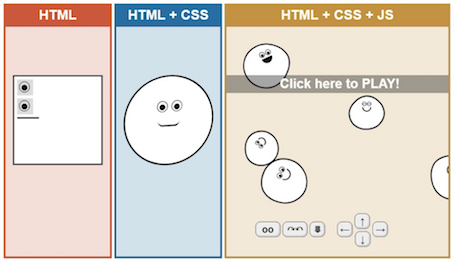

# HTML

**HTML** é a base de todas as aplicações Web e é importante que você saiba como utilizar corretamente essa linguagem de marcação de texto, assim como **CSS** e **JavaScript**, que andam de mãos dadas na construção de aplicações Web.

Se você não tem experiência com HTML ou precisa relembrar alguma coisa, recomendamos que siga o [tutorial oficial do **W3Schools**](https://www.w3schools.com/html/) -- neste site você também encontra excelentes guias e tutoriais relacionados a desenvolvimento Web.

