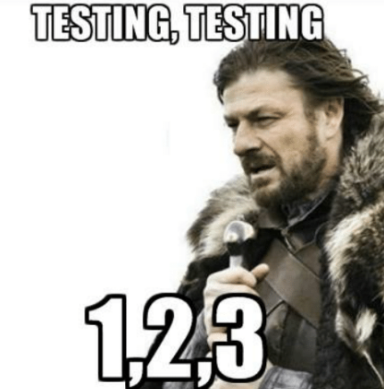

# Turbinando os seus testes

Pode falar, vai. Testar é bem chatinho, né? Mas essa ideia de que quem testa código é só profissional de QA é muuuito errada! Então aqui a gente vai dar uma dicas para turbinar os seus testes 🚀 e facilitar um pouco mais a sua vida.

{% embed data="{\"url\":\"https://10minutemail.com/10MinuteMail/index.html?dswid=-7405\",\"type\":\"link\",\"title\":\"10 Minute Mail  - Temporary E-Mail\",\"description\":\"Temporary disposable e-mail service to beat spam.  Avoid spam with a free secure e-mail address.\",\"icon\":{\"type\":\"icon\",\"url\":\"https://10minutemail.com/favicon.ico\",\"aspectRatio\":0},\"caption\":\"E-mail temporário que vai durar por 10 minutos. Uma maravilha pra garantir que aquele e-mail que seu método está enviando realmente chega para o destinatário.\"}" %}

{% embed data="{\"url\":\"https://mailtrap.io/\",\"type\":\"link\",\"title\":\"Mailtrap.io — Fake smtp testing server. Dummy smtp email testing\",\"description\":\"Mailtrap is a fake SMTP server for development teams to test, view and share emails sent from the development and staging environments without spamming real customers\",\"icon\":{\"type\":\"icon\",\"url\":\"https://mailtrap.io/assets/favicon-196x196-85d4140ea1aefe37e7a94e27517f986f4c6682dedb3c14b07403dfea207a9c8f.png\",\"width\":196,\"height\":196,\"aspectRatio\":1},\"caption\":\"Outra diquinha para os e-mails! Tá cansado \(a\) de receber 500 mil e-mails de testes? Eu também! Então usa esse servidor de SMTP falso pra você conseguir testar de boinha 😎\"}" %}

{% embed data="{\"url\":\"https://www.4devs.com.br/gerador\_de\_pessoas\",\"type\":\"link\",\"title\":\"Gerador de documentos de pessoas \(Nome, RG, CPF, CEP, Endereço, etc\) - 4Devs\",\"description\":\"Gerador Online de Documentos de Pessoas, gera NOME, RG, CPF, CEP, Endereço, tudo válido.\",\"icon\":{\"type\":\"icon\",\"url\":\"https://www.4devs.com.br/apple-touch-icon.png\",\"width\":180,\"height\":180,\"aspectRatio\":1},\"caption\":\"Agora que você colocou um código para garantir se os documentos são válidos você não consegue mais digitar qualquer coisa no teclado, né? Ainda bem! Significa que você está validando direito ✅ Mas você pode usar esse gerador de pessoas aí pra facilitar mais a sua vida. \"}" %}

{% embed data="{\"url\":\"https://www.mockapi.io\",\"type\":\"link\",\"title\":\"mockAPI\",\"description\":\"MockAPI is a free tool that lets you easily mock up APIs, generate custom data, and preform operations on it using RESTful interface. MockAPI is meant to be used as a prototyping/testing/learning tool.\",\"icon\":{\"type\":\"icon\",\"url\":\"https://www.mockapi.io/favicon.ico\",\"aspectRatio\":0},\"caption\":\"Esta ferramenta permite que você construa APIs para teste com dados personalizados de acordo com a sua necessidade!\"}" %}

  
Sabe o quê mais pode te ajudar a produzir código sem erros? Criar [testes unitários](https://www.devmedia.com.br/e-ai-como-voce-testa-seus-codigos/39478)! Quanto maior for ficando a sua aplicação, mais difícil ficará de testar. Com a geração de testes unitários, você pode testar tudo com um simples comando. Separamos alguns links para te ajudarem na criação de testes unitários para aplicações em **Vue** e **React**.

* [Unit Testing - Vue.js](https://vuejs.org/v2/guide/unit-testing.html)
* [How to write a unit test for Vue.js](https://scotch.io/tutorials/how-to-write-a-unit-test-for-vuejs)
* [Testing React apps \(Jest\)](https://jestjs.io/docs/en/tutorial-react)
* [The right way to test React components](https://medium.freecodecamp.org/the-right-way-to-test-react-components-548a4736ab22)
* [Unit Testing Behavior of React Components with Test-Driven Development](https://medium.com/capital-one-developers/unit-testing-behavior-of-react-components-with-test-driven-development-ae15b03a3689)

